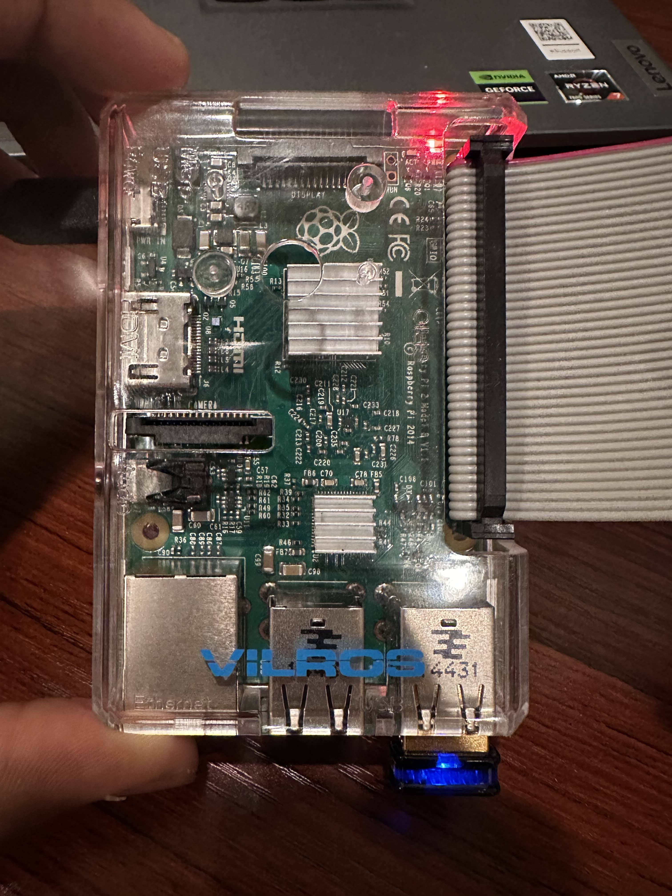
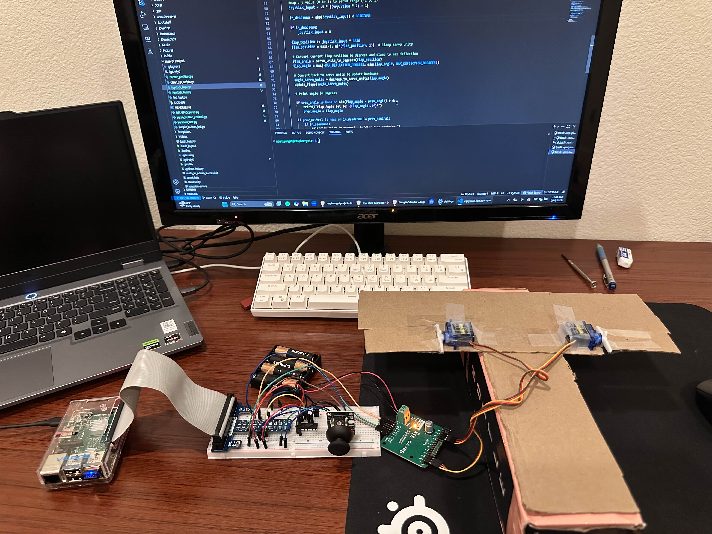
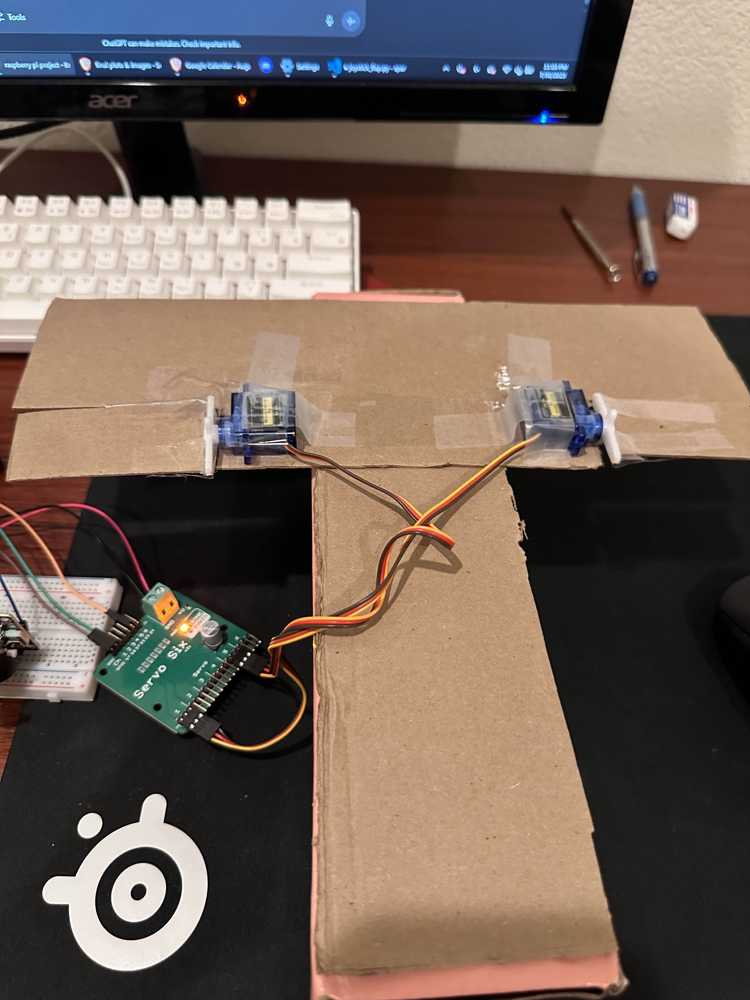
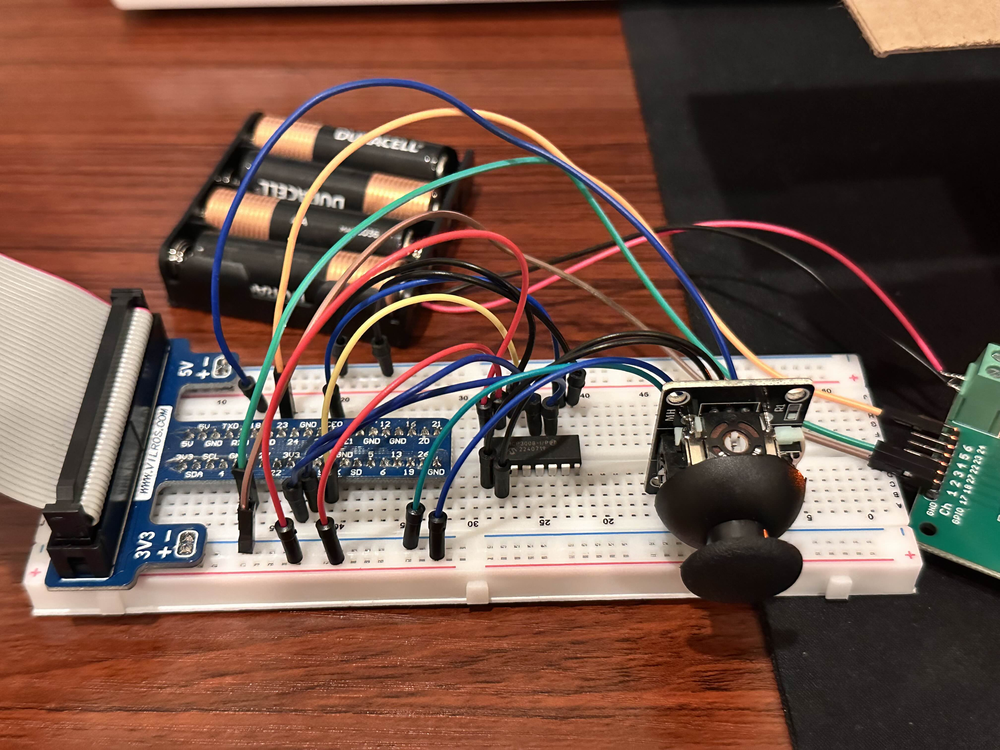
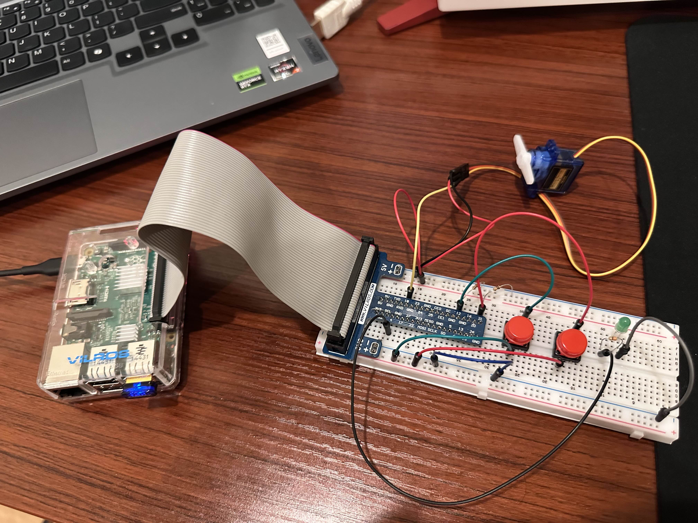

# Raspberry Pi Engineering Projects

## Overview
A set of hands-on Raspberry Pi projects using Python to control hardware and build simple circuits. All code was written in Python 3 using Visual Studio Code, with remote development via SSH into the Raspberry Pi 

This repository documents my progression from basic GPIO output (blinking an LED) to a functioning aircraft flap control simulation using analog input and  servo actuation

These projects helped me gain experience with analog-to-digital conversion using the MCP3008, software PWM via gpiozero, breadboard wiring, and writing modular, readable Python code.

---

## Final Project: Aircraft Flap Controller with Joystick

### Description
Simulates the manual control of an aircraft’s wing flap using a joystick. The joystick’s vertical position (Y-axis) directly controls the servo’s angle, simulating actuator control. The system “stays in place” — the flap remains at the last joystick input position

Flight behavior mapping:
- Pushing the joystick forward/up → tilts the flap trailing edge up (elevator deflects up) → nose pitches up → "plane" climbs
- Pulling the joystick back/down → tilts the flap trailing edge down (elevator deflects down) → nose pitches down → "plane" descends

Note: This is a low-cost, **proof-of-concept prototype** built from scrap cardboard and simple components. The focus is on replicating core control behaviors, not creating a polished or scaled model.

### Features
- Real-time analog input from joystick using MCP3008
- Servo control via gpiozero with PiGPIOFactory (software PWM)
- Safe shutdown using keyboard interrupt
- Live terminal output for debugging and feedback

### Skills Applied
- Scaled input → servo angle output
- Breadboard design
- System-level design: interrupt handling, GPIO cleanup
- Debugging unstable servo movement and electrical noise
- Clean, structured Python code

### Media

**Raspberry Pi Board**  

**Flap Setup – Upside-Down View**  

**Close-up of Flap Mechanism**  

**Breadboard Wiring**  

**Demo Video**  
[▶ Watch flap_demo.mp4](media/flap_demo.mp4)

**Setup Video**  
[▶ Watch flap_setup.mp4](media/flap_setup.mp4)

---

## Previous Mini Project: Button Servo Control

### Description
Before the joystick-based system, I built a simple button-controlled servo project where two pushbuttons were used — one to increase angle, one to decrease. An LED turns on while the servo moves. This project introduced GPIO input, PWM, and control logic fundamentals.

### Features
- Button-based servo angle control (0°–180°)
- Debouncing using delay logic
- LED activity indicator
- Started with RPi.GPIO, later switched to gpiozero

### Media

**Button Control Setup**  

**Demo Video**  
[▶ Watch button_control_demo.mp4](media/button_control_demo.mp4)

--- 

## Hardware Used
- Raspberry Pi Model 2 B
- SG90 Micro Servo Motor
- Breadboard
- Pushbuttons
- Red LED
- Joystick module
- MCP3008 ADC chip
- 4xAA battery pack (external servo power)
- Jumper wires, resistors, etc.

---

## Lessons & Takeaways
- Transitioned from `RPi.GPIO` to `gpiozero` to enable smoother, more precise PWM for servos
- Gained confidence in reading datasheets, wiring ADC chips, and building stable breadboard circuits
- Improved Python coding habits: modular structure, safe shutdown handling, error prevention, clarity 
- Built a full control loop: physical input → Python logic → actuator output 
- Understood trade-offs in embedded system design (power, noise, response)

---

## Resources Used
- gpiozero Official Documentation: https://gpiozero.readthedocs.io/en/stable/index.html
- Raspberry Pi Physical Computing Guide: https://projects.raspberrypi.org/en/projects/physical-computing/0 
- Youtube video on servo motor control: https://www.youtube.com/watch?v=_fdwE4EznYo
- Youtube video on MCP3008 wiring: https://www.youtube.com/watch?v=tn8sEqq0sJc 
